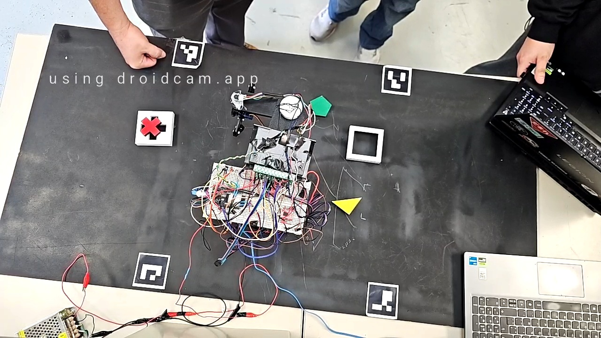
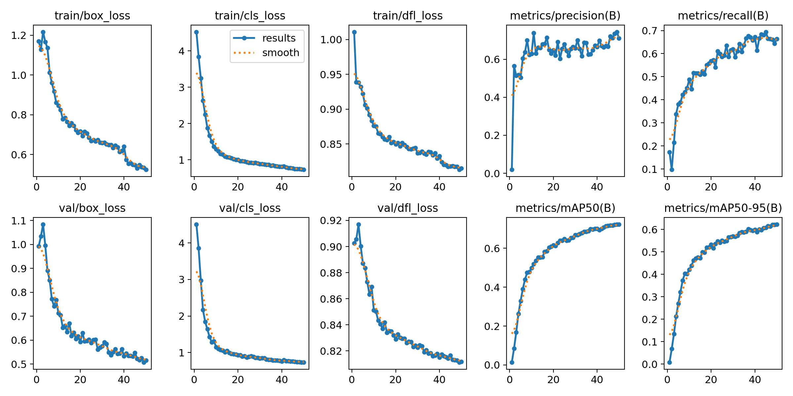

# ScaraCV — Vision-Guided Pick-and-Place for a 4-DoF SCARA Robot

Computer-vision pipeline that detects, classifies, and localizes colored geometric
pieces on a workbench and hands off pick coordinates to a 4-DoF SCARA robot over
MQTT. Built as part of a Model-in-the-Loop → hardware pick-and-place project
(83% success rate on the physical robot).

## Pipeline

1. **`PnP_App/tomar_foto.py`** — captures a frame from a phone camera (via
   DroidCam) or any webcam.
2. **`PnP_App/PNP.ipynb`** — the live vision pipeline that runs on that frame:
   - Edge detection (Laplacian) + Harris corner detection
   - HSV color segmentation (red / yellow / green / blue) and multi-epsilon
     shape classification (square, triangle, pentagon, cross)
   - Gripper orientation angle calculation per detected piece
   - ArUco marker homography to convert pixel coordinates → real-world mm
     (60×60 mm calibration square)
   - Publishes pick coordinates + angle to the robot's ESP32 over **MQTT**
   - Logs every detection run to CSV for traceability
3. **`Preannotate/`** — the dataset pipeline used to train a YOLO detector as a
   faster alternative/complement to the HSV approach:
   - `auto_annotate.py` — auto-labels raw photos using the same HSV +
     shape-classification logic, in YOLO `.txt` format, plus preview images
     for visual QA
   - `dividir_dataset.py` — splits the labeled set into train/val (80/20) and
     generates `data.yaml`
   - `entrenar.py` — trains a YOLOv11n model (`ultralytics`) on the resulting
     dataset
   - `runs/` — training results for the current best run: loss/mAP curves,
     confusion matrix, validation prediction grids, and the trained weights
     (`weights/best.pt`, `weights/last.pt`)

## Training results

## Stack

Python, OpenCV (HSV segmentation, ArUco, Harris/Laplacian), Ultralytics YOLOv11n,
MQTT (`paho-mqtt`), ESP32 (robot-side controller), DroidCam.

## Notes

The raw/intermediate dataset folders (`auto_images/`, `auto_labels/`,
`auto_preview/`, `dataset/`) are regenerated by `auto_annotate.py` +
`dividir_dataset.py` and are not tracked here — only the code and the final
training run are. See the [SCARA robot write-up](https://paulinism.github.io/projects/scara-robot/)
in my portfolio for the full Model-in-the-Loop → hardware project this feeds
into.
